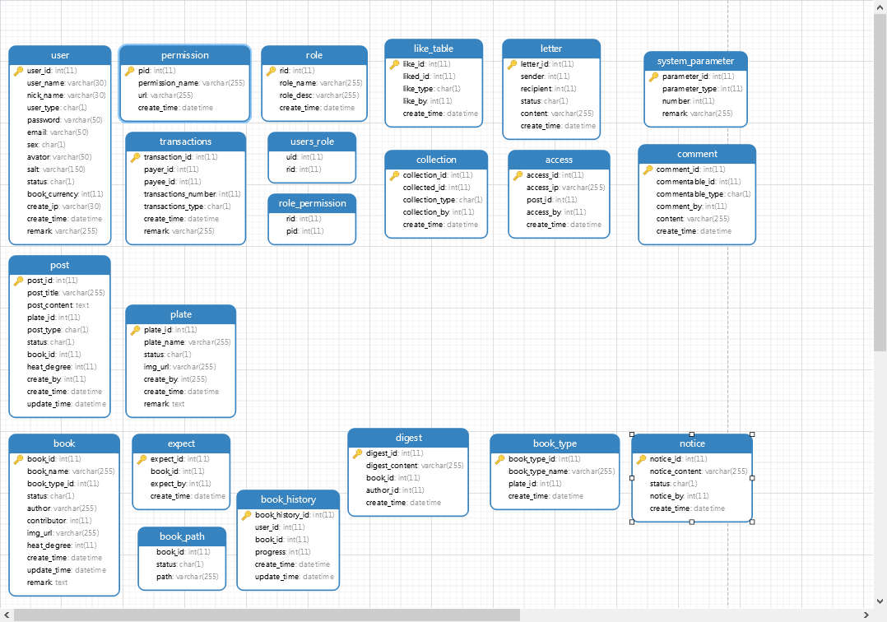
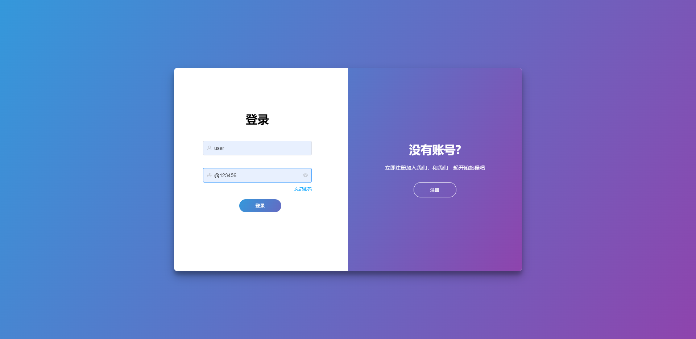
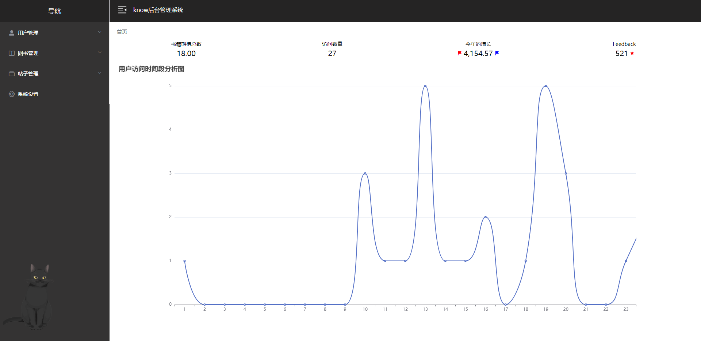

# KNOW
### 功能介绍
系统主要由图书和论坛进行组合，围绕单个图书进行展示，主要实现功能有，用户认证授权，图书管理与展示，帖子管理与展示。

### 技术介绍
后端采用springboot+spring-security+jwt，来实现业务功能的编写，前端主要使用vue2+element-ui进行页面的编辑和美化。

### 数据库表设计

### 页面展示
**登录**

**找回密码**

**首页**

**编辑帖子**

**图书展示**

**帖子展示**

**后台首页**

