      项目整体采用Springboot+vue+axios+websocket来实现系统，采用springsecurity来进行鉴权，使用token来进行身份标志，vuex全局状态管理、vue-router等。

       数据库总E-R图展示如下

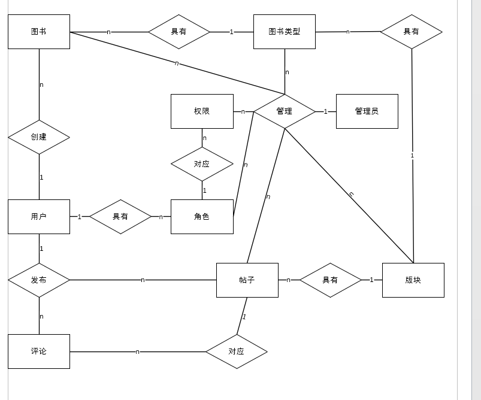

总体采用版块管理图书类型，书籍类型管理帖子和图书的方式进行细化图书和帖子的分类，其中还有一些表尚未展示，总体以永固、帖子、图书三个部分，有些功能尚未完善，部分表尚未使用。

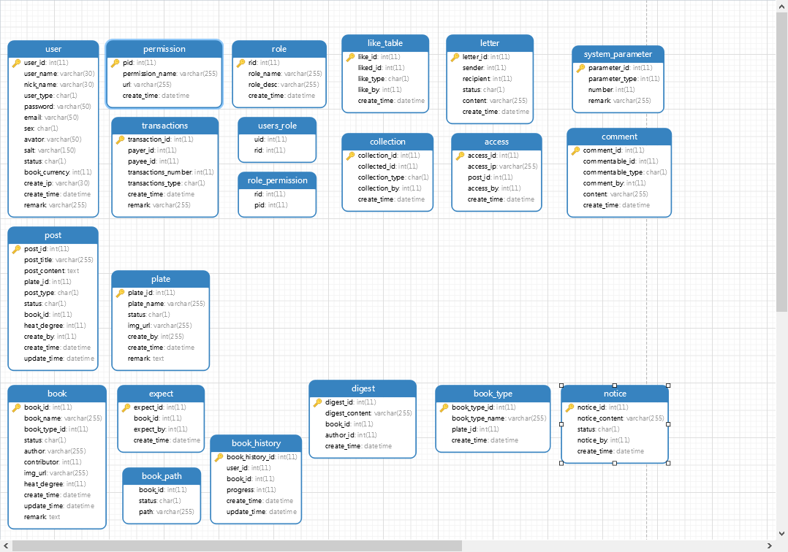

登录页面展示

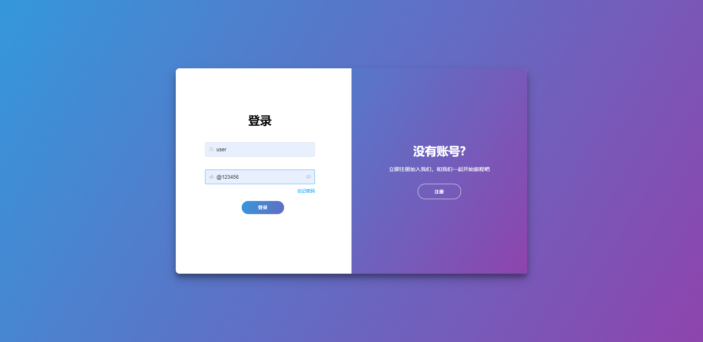

用户首页展示

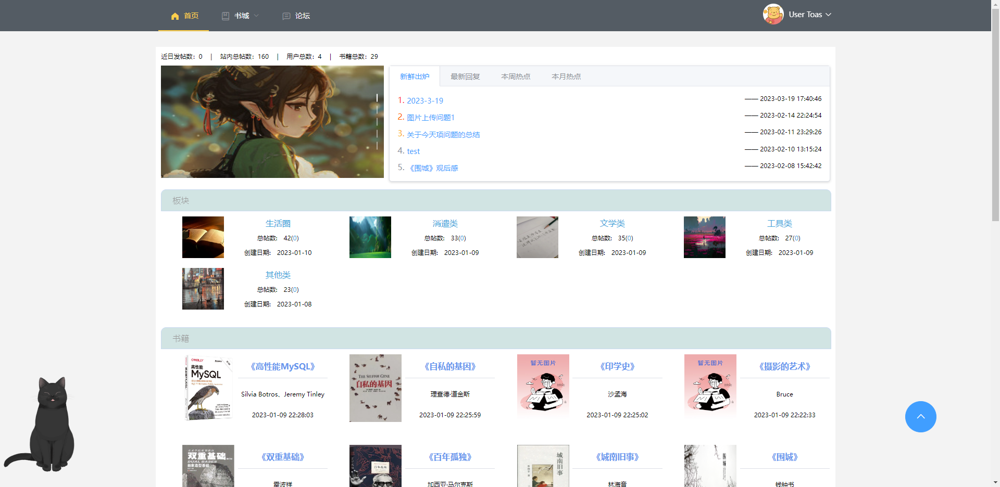

图书展示

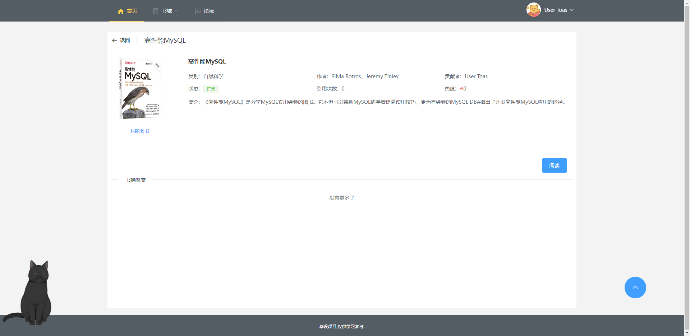

帖子编辑展示

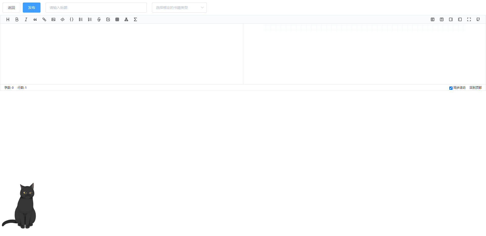

书库展示

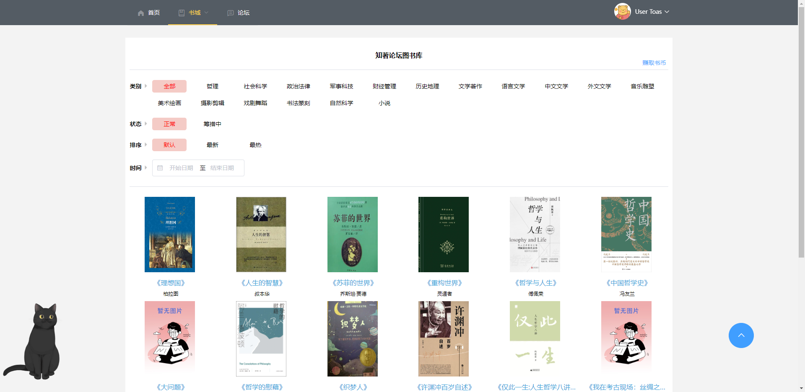

论坛展示

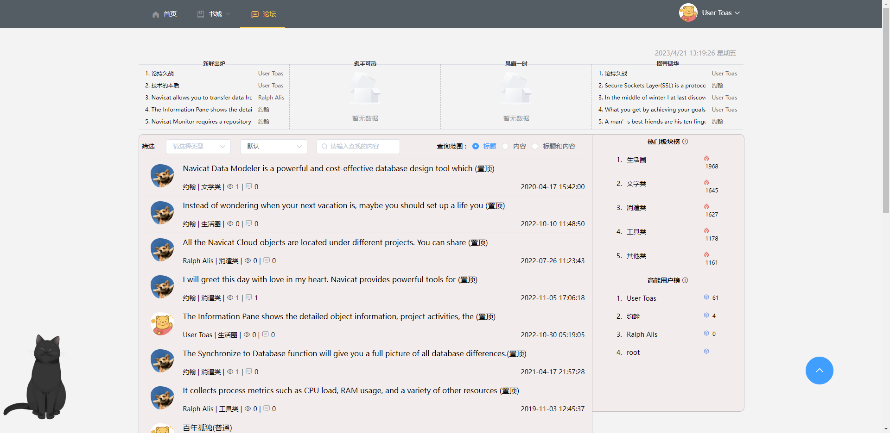

重置密码展示

后台首页展示

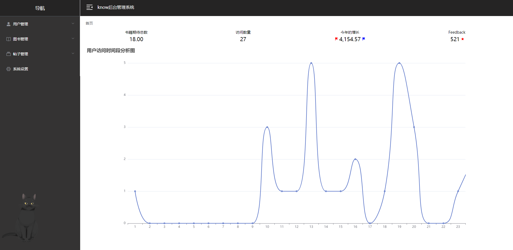

用户以及路径匹配展示

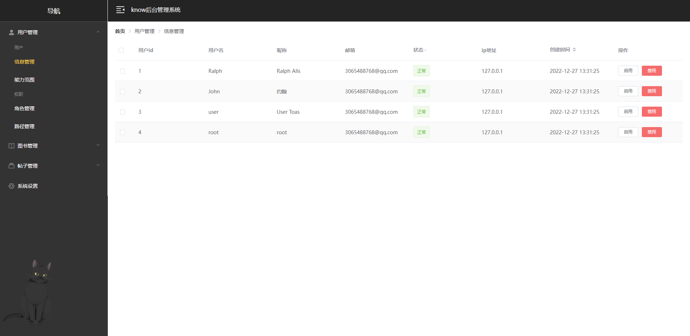

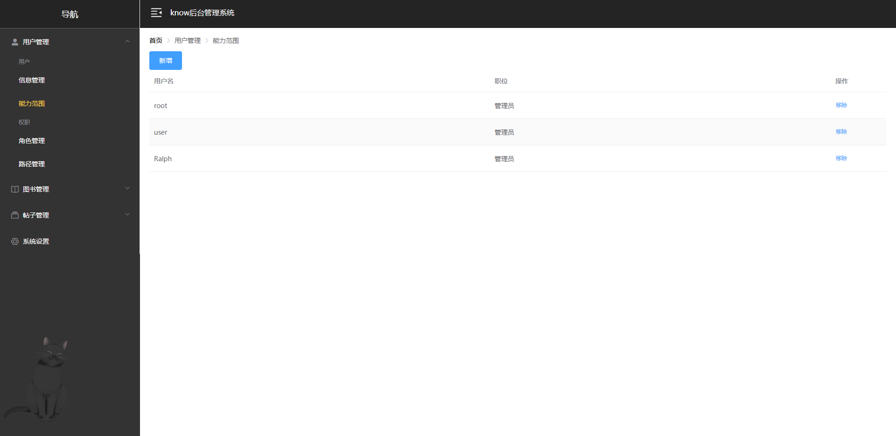

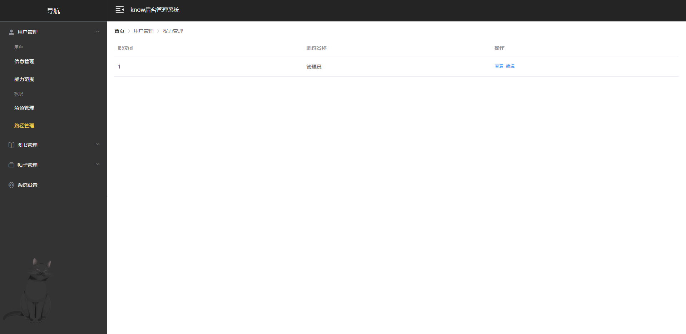

图书及书类展示

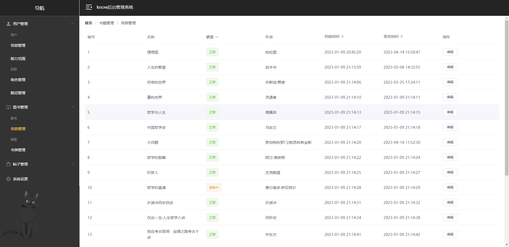

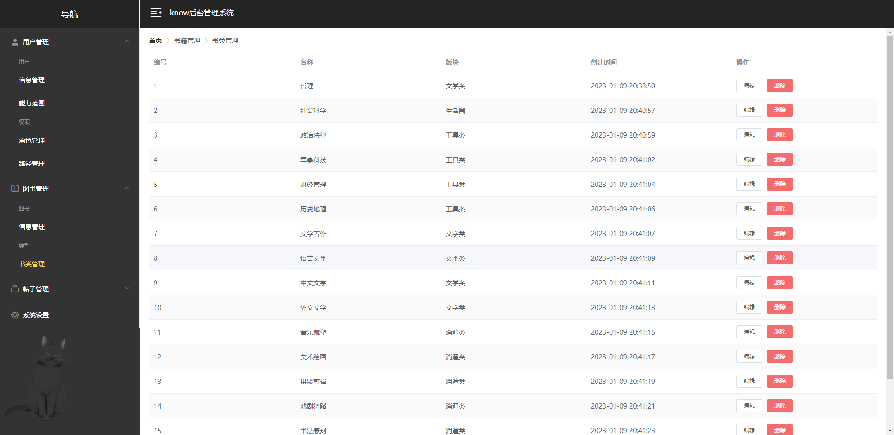

帖子及版块展示

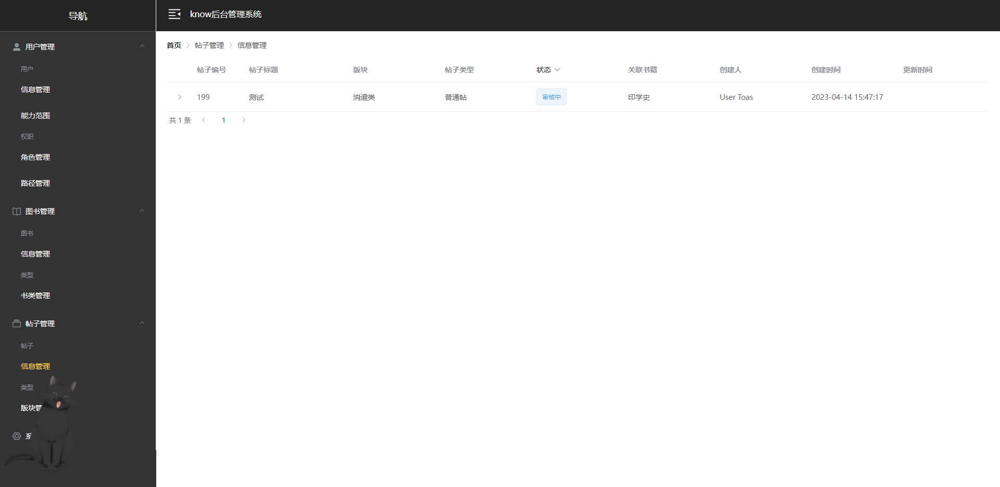

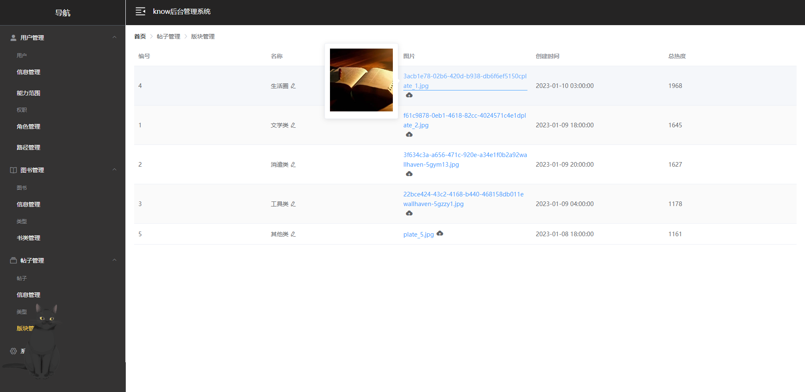
